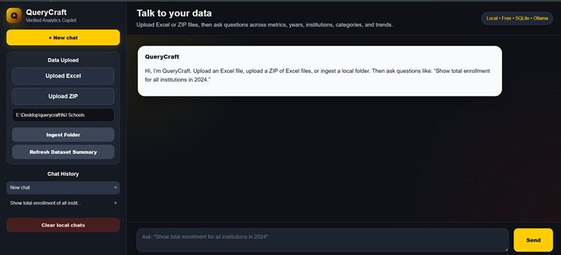
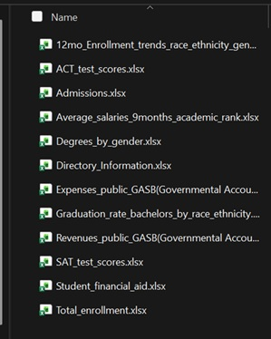
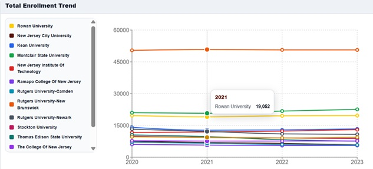
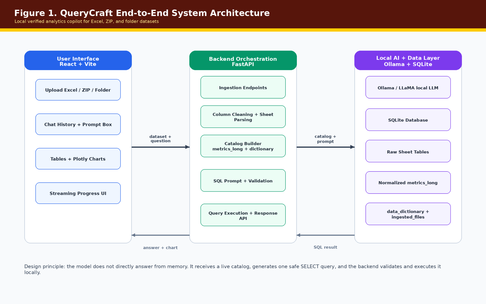
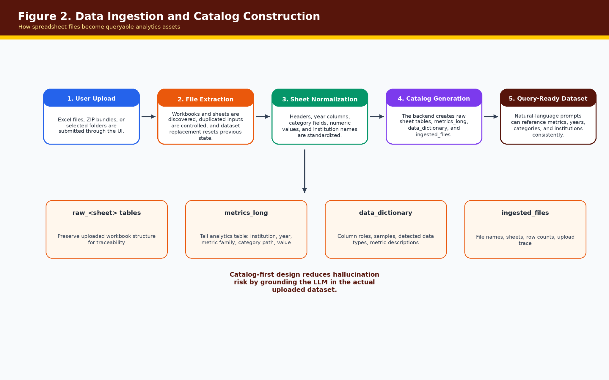
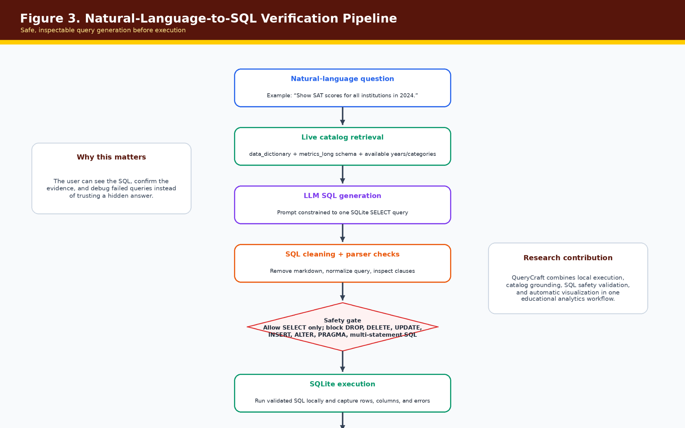
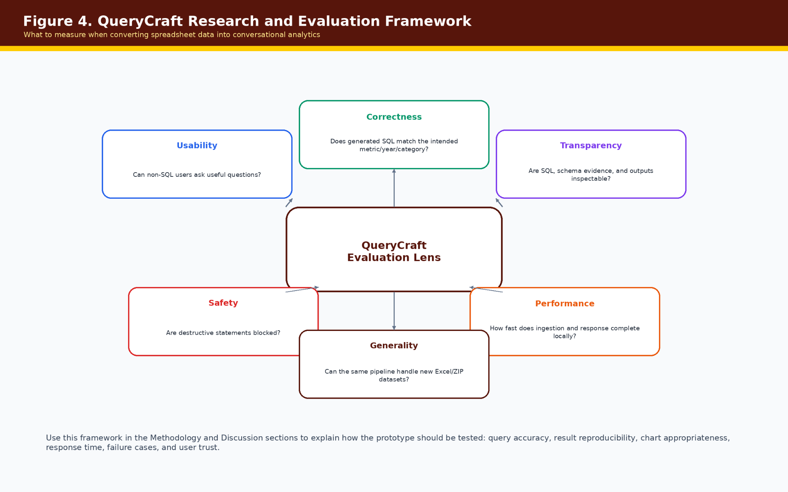

# QueryCraft — Verified Analytics Copilot

**QueryCraft** is a local “talk to your data” analytics copilot for Excel, ZIP, and folder-based datasets. Users can upload structured spreadsheet data, ask questions in natural language, and receive transparent answers backed by generated SQL, result tables, charts, and schema evidence.

<p align="center">
  
</p>

<p align="center">
  <strong>Local • Free • SQLite • Ollama • FastAPI • React</strong>
</p>

---

## Table of Contents

- [Overview](#overview)
- [Demo Screenshots](#demo-screenshots)
- [System Architecture](#system-architecture)
- [How QueryCraft Works](#how-querycraft-works)
- [Research and Evaluation Framework](#research-and-evaluation-framework)
- [Main Features](#main-features)
- [Technology Stack](#technology-stack)
- [Project Structure](#project-structure)
- [Prerequisites](#prerequisites)
- [How to Run QueryCraft](#how-to-run-querycraft)
- [How to Use the App](#how-to-use-the-app)
- [Example Questions](#example-questions)
- [Database Tables](#database-tables)
- [SQL Safety](#sql-safety)
- [API Endpoints](#api-endpoints)
- [Troubleshooting](#troubleshooting)
- [Recommended Files to Commit](#recommended-files-to-commit)
- [Suggested GitHub Repository Tagline](#suggested-github-repository-tagline)

---

## Overview

QueryCraft is not just a normal chatbot. It is a verified analytics workflow that turns uploaded spreadsheet data into a queryable local database.

Instead of answering from memory, QueryCraft follows a safer process:

```text
Excel / ZIP / Folder
        ↓
Data ingestion
        ↓
SQLite database
        ↓
Dynamic data catalog
        ↓
Local LLM using Ollama
        ↓
Safe SQL generation
        ↓
SQL validation
        ↓
Query execution
        ↓
Table + chart + evidence in the UI
```

The goal is to help non-SQL users explore structured datasets through plain-English questions while still keeping the results inspectable and reproducible.

---

## Demo Screenshots

### 1. Example input dataset

QueryCraft can ingest a folder containing multiple Excel files, such as admissions, enrollment, graduation, financial aid, SAT/ACT, revenue, and expense files.

<p align="center">
  
</p>

### 2. QueryCraft chat interface

The interface includes data upload controls, local folder ingestion, chat history, prompt input, generated answers, SQL evidence, and chart outputs.

<p align="center">
  
</p>

### 3. Example chart output

QueryCraft can return visual analytics such as bar charts, line charts, grouped charts, heatmaps, pie charts, and donut charts based on the query result shape.

<p align="center">
  
</p>

---

## System Architecture

QueryCraft is designed as a local verified analytics copilot. The frontend captures the dataset and user question, the backend prepares a data catalog and validates SQL, and the local data layer executes only safe queries against SQLite.

<p align="center">
  
</p>

The key design principle is that the model does not directly answer from memory. It receives a live catalog, generates one safe `SELECT` query, and the backend validates and executes that query locally.

---

## How QueryCraft Works

### Data ingestion and catalog construction

When a user uploads an Excel file, ZIP file, or local folder, QueryCraft extracts the sheets, cleans column names, detects year columns, identifies numeric values, and builds query-ready tables.

<p align="center">
  
</p>

The ingestion pipeline creates:

- raw sheet tables for traceability
- `metrics_long` for analytics queries
- `data_dictionary` for schema grounding
- `ingested_files` for upload traceability

### Natural-language-to-SQL verification

QueryCraft uses a catalog-first natural-language-to-SQL pipeline. The LLM receives the schema and user question, generates SQL, and the backend checks the query before execution.

<p align="center">
  
</p>

This keeps the workflow transparent because the user can inspect the generated SQL, confirm the evidence, and debug failed queries instead of trusting a hidden answer.

---

## Research and Evaluation Framework

QueryCraft can be evaluated across correctness, usability, transparency, safety, performance, and generality.

<p align="center">
  
</p>

Suggested evaluation metrics include:

- SQL correctness against intended metric, year, category, and institution
- result reproducibility across repeated prompts
- chart appropriateness for returned columns
- response time for ingestion and chat queries
- percentage of unsafe SQL blocked
- user ability to understand SQL evidence and outputs
- generalization across new Excel/ZIP datasets

---

## Main Features

QueryCraft supports:

- Excel upload
- ZIP upload with multiple Excel files
- local folder ingestion
- automatic clearing of old uploaded data before new ingestion
- SQLite database creation
- raw table storage
- normalized long-format analytics table
- dynamic data catalog generation
- natural-language-to-SQL query generation
- SQL validation before execution
- generated SQL display
- result tables
- bar charts
- line charts
- grouped bar charts
- heatmaps
- pie and donut charts
- ChatGPT-style interface
- chat history saved in browser local storage
- local Ollama model support
- no Azure requirement
- no paid LLM account requirement

---

## Technology Stack

| Layer | Technology |
|---|---|
| Frontend | React + Vite |
| Styling | CSS |
| Backend | FastAPI + Python |
| Database | SQLite |
| LLM Runtime | Ollama |
| Local Model | LLaMA through Ollama |
| Data Processing | pandas, openpyxl |
| Charts | Plotly/Recharts depending on frontend version |
| Storage | Local filesystem + SQLite |

---

## Project Structure

```text
querycraft/
│
├── backend/
│   ├── app/
│   │   ├── __init__.py
│   │   ├── main.py
│   │   ├── config.py
│   │   ├── database.py
│   │   ├── schemas.py
│   │   └── services/
│   │       ├── __init__.py
│   │       ├── chat_service.py
│   │       ├── ingestion_service.py
│   │       ├── llm_service.py
│   │       ├── metadata_service.py
│   │       └── sql_service.py
│   ├── uploads/
│   ├── querycraft.db
│   └── requirements.txt
│
├── frontend/
│   ├── src/
│   │   ├── App.jsx
│   │   ├── App.css
│   │   ├── index.css
│   │   └── main.jsx
│   ├── package.json
│   └── vite.config.js
│
├── docs/
│   └── images/
│       ├── Figure_1_QueryCraft_End_to_End_Architecture.png
│       ├── Figure_2_QueryCraft_Data_Ingestion_and_Catalog.png
│       ├── Figure_3_QueryCraft_NL_to_SQL_Verification_Pipeline.png
│       ├── Figure_4_QueryCraft_Evaluation_Framework.png
│       ├── Figure_5_QueryCraft_Dataset_Folder.jpg
│       ├── Figure_6_QueryCraft_UI.jpg
│       └── Figure_7_QueryCraft_Chart_Result.jpg
│
└── README.md
```

---

## Prerequisites

Install the following before running QueryCraft.

### Python

Python 3.10 or newer is recommended.

Check Python:

```powershell
python --version
```

### Node.js

Check Node and npm:

```powershell
node -v
npm -v
```

### Ollama

Install Ollama and download/run the local model:

```powershell
ollama run llama3
```

Test it by typing:

```text
hello
```

If Ollama replies, the model is ready.

---

## How to Run QueryCraft

Assume the project is located here:

```text
E:\Desktop\querycraft
```

### 1. Start Ollama

Open PowerShell:

```powershell
ollama run llama3
```

Keep this running while using QueryCraft.

### 2. Start the backend

Open a second PowerShell terminal:

```powershell
cd E:\Desktop\querycraft\backend
pip install -r requirements.txt
uvicorn app.main:app --reload
```

Expected backend URL:

```text
http://127.0.0.1:8000
```

Swagger API docs:

```text
http://127.0.0.1:8000/docs
```

### 3. Start the frontend

Open a third PowerShell terminal:

```powershell
cd E:\Desktop\querycraft\frontend
npm install
npm run dev
```

Expected frontend URL:

```text
http://localhost:5173/
```

---

## How to Use the App

### Option 1 — Upload one Excel file

1. Click **Upload Excel**.
2. Select a `.xlsx` or `.xls` file.
3. Wait for ingestion to finish.
4. Ask a question in the chat box.

### Option 2 — Upload ZIP of Excel files

1. Click **Upload ZIP**.
2. Select a `.zip` file containing Excel files.
3. Wait for ingestion to finish.
4. Ask questions across the uploaded files.

### Option 3 — Ingest local folder

If your Excel files are stored in a folder, paste the folder path into the sidebar input and click **Ingest Folder**.

Example:

```text
E:\Desktop\querycraft\NJ Schools
```

QueryCraft clears the previous ingested dataset before loading the new one, which prevents old and new data from mixing.

---

## Example Questions

### Dataset overview

```text
Show the available metric families in the dataset
```

```text
What tables are available?
```

```text
What years are covered?
```

### Bar chart

```text
Show total enrollment for all institutions in 2024 as a bar chart
```

```text
Which institutions had the highest total enrollment in 2024?
```

### Line chart

```text
Show Rowan University total enrollment trend from 2015 to 2024 as a line chart
```

### Grouped bar chart

```text
Compare Rowan University, Montclair State University, and Kean University total enrollment from 2020 to 2024 as a grouped bar chart
```

### Heatmap

```text
Show graduation rate by race and year for Rowan University as a heatmap
```

### Pie or donut chart

```text
Show total enrollment by institution in 2024 as a donut chart
```

```text
Show Pell grants average amount by institution for 2023 as a pie chart
```

---

## Database Tables

QueryCraft creates several SQLite tables.

### Raw tables

Each Excel sheet becomes a raw table. Raw tables preserve the original sheet structure for traceability.

Example raw tables:

```text
raw_total_enrollment_tablelibrary
raw_admissions_admissions
raw_student_financial_aid_tablelibrary
```

### `metrics_long`

This is the main analytics table used for most chatbot questions.

Important columns:

```text
source_file
source_sheet
source_table
metric_family
unit_id
institution_name
category_1
category_2
category_3
metric_path
year_label
year_int
value_text
value_numeric
```

### `data_dictionary`

This stores detected metadata used to ground the LLM.

```text
source_file
source_sheet
table_name
column_name
detected_role
sample_values
```

### `ingested_files`

This stores ingestion history.

```text
file_name
sheet_name
raw_table_name
rows_loaded
columns_loaded
ingested_at
```

---

## SQL Safety

QueryCraft validates SQL before running it.

Allowed:

```sql
SELECT ...
```

Blocked:

```sql
DROP
DELETE
UPDATE
INSERT
ALTER
CREATE
REPLACE
TRUNCATE
ATTACH
DETACH
VACUUM
PRAGMA
```

Also blocked:

- multiple SQL statements
- SQL comments
- unauthorized tables
- destructive database operations

The backend can also apply a default limit when needed so large queries do not overload the UI.

---

## API Endpoints

| Endpoint | Purpose |
|---|---|
| `GET /` | Backend status |
| `POST /chat` | Normal JSON chat response |
| `POST /chat/stream` | Step-by-step streaming chat response |
| `GET /schema` | Generated data catalog |
| `POST /upload/excel` | Upload and ingest one Excel file |
| `POST /upload/zip` | Upload and ingest ZIP of Excel files |
| `POST /ingest/folder` | Ingest local folder |
| `POST /ingestion/reset` | Clear uploaded and ingested data |
| `GET /ingestion/summary` | Dataset summary |

---

## Troubleshooting

### Backend says module not found

Run the backend from the `backend` folder:

```powershell
cd E:\Desktop\querycraft\backend
uvicorn app.main:app --reload
```

Do not run it from `backend/app`.

### Frontend cannot connect to backend

Make sure the backend is running at:

```text
http://127.0.0.1:8000
```

Then confirm the frontend uses this backend base URL in `App.jsx`.

### Ollama is not responding

Start Ollama:

```powershell
ollama run llama3
```

Then test with:

```text
hello
```

### Model is slow

This is normal for local LLMs. Options:

- use a smaller model
- reduce catalog size
- ask more specific questions
- keep Ollama warm by running one test question first

### Old data appears after uploading new data

Use the reset endpoint or re-ingest through the UI after reset logic is enabled:

```text
POST /ingestion/reset
```

### Chart does not appear

A chart needs the correct result columns. Ask directly:

```text
Show total enrollment for all institutions in 2024 as a bar chart
```

```text
Show Rowan University total enrollment trend from 2015 to 2024 as a line chart
```

```text
Show graduation rate by race and year for Rowan University as a heatmap
```

---

## Recommended Files to Commit

Commit:

```text
README.md
docs/images/
backend/app/
backend/requirements.txt
frontend/src/
frontend/package.json
frontend/vite.config.js
```

Do not commit:

```text
backend/querycraft.db
backend/uploads/
node_modules/
__pycache__/
.venv/
frontend/dist/
```

Recommended `.gitignore`:

```gitignore
# Python
__pycache__/
*.pyc
.venv/
env/
venv/

# Database and uploads
backend/querycraft.db
backend/uploads/

# Node
frontend/node_modules/
frontend/dist/

# OS
.DS_Store
Thumbs.db
```

---

## Suggested GitHub Repository Description

```text
A local AI analytics copilot for talking to Excel and ZIP datasets using React, FastAPI, Ollama, SQLite, and safe NL-to-SQL.
```

---

## Final Run Checklist

1. Start Ollama.

```powershell
ollama run llama3
```

2. Start the backend.

```powershell
cd E:\Desktop\querycraft\backend
uvicorn app.main:app --reload
```

3. Start the frontend.

```powershell
cd E:\Desktop\querycraft\frontend
npm install
npm run dev
```

4. Open the app.

```text
http://localhost:5173/
```

5. Upload Excel/ZIP or ingest a folder.
6. Ask questions.
7. Inspect SQL, tables, charts, and evidence.
